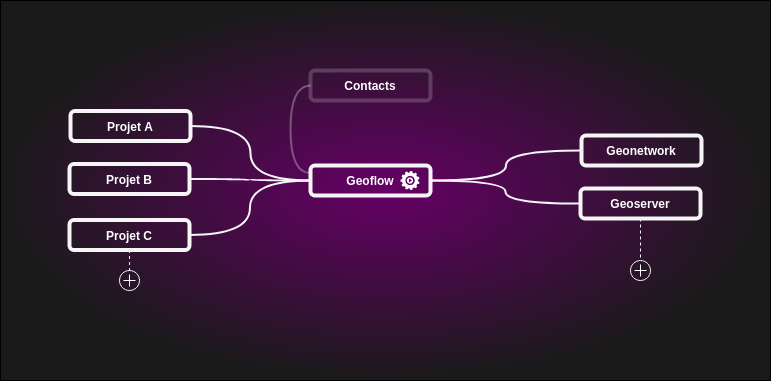

# geoflow_gui

Small user interface for Linux / Windows to generate Metadata table and execute Geoflow ( R library developped by E.blondel)

## Input 
WIP : select data location (local storage, Google drive, Postgres)

## Geoflow
WIP
## Output
WIP